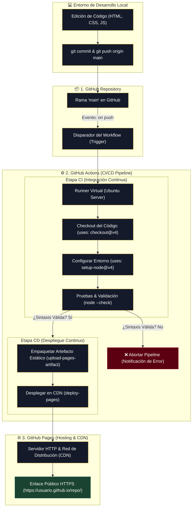

# Guía Explicativa: Flujo de CI/CD con GitHub Repos ➔ GitHub Actions ➔ GitHub Pages

Esta guía ofrece una explicación técnica y conceptual explícita sobre cómo se interconectan **GitHub Repositories**, **GitHub Actions** y **GitHub Pages** para automatizar el ciclo de vida del software desde el código fuente hasta la publicación en la web global.

---

## 📐 1. Arquitectura General del Flujo

El siguiente diagrama visualiza la ruta completa que sigue tu código desde que ejecutas `git push` en tu computadora hasta que un usuario abre la página en su navegador:



---

## 🛠️ 2. Desglose Componente por Componente

### 📦 2.1. GitHub Repositories (Almacenamiento y Disparador)

El **repositorio** es el almacén central donde se conserva la historia de versiones de tu código fuente mediante Git.

* **Función en el flujo**:
  * Funciona como la **fuente de verdad** (*Single Source of Truth*).
  * Actúa como el **disparador de eventos** (*Event Trigger*).
* **Cómo funciona**:
  Cuando ejecutas `git push origin main`, GitHub detecta el evento de actualización de código. Si existe un archivo YAML en la carpeta `.github/workflows/`, GitHub lee el encabezado del archivo:
  ```yaml
  on:
    push:
      branches:
        - main
  ```
  Esto le indica a GitHub que debe iniciar automáticamente la ejecución de un servidor virtual en la nube.

---

### ⚙️ 2.2. GitHub Actions (Motor de Automatización y CI/CD)

**GitHub Actions** es la plataforma de automatización donde ejecutas pipelines de CI/CD dentro de contenedores o máquinas virtuales efímeras operadas por GitHub.

* **Integración Continua (CI)**:
  * **Máquina Virtual (Runner)**: Se asigna un servidor `ubuntu-latest` limpio.
  * **Descarga de Código (`actions/checkout`)**: La máquina clona tu repositorio en su disco temporal.
  * **Pruebas y Verificación**: Se instalan las dependencias y se ejecutan comandos de validación (por ejemplo, `node --check script.js`).
  * **Control de Calidad (Gatekeeper)**: Si alguna prueba falla, el pipeline se detiene inmediatamente. **Nada que tenga errores se publica en producción.**

* **Despliegue Continuo (CD)**:
  * **Empaquetado (`upload-pages-artifact`)**: GitHub Actions comprime los archivos estáticos de tu sitio (HTML, CSS, JS e imágenes).
  * **Transferencia Segura (`deploy-pages`)**: Transfiere el paquete comprimido directamente a la infraestructura de servidores de **GitHub Pages**.

> [!IMPORTANT]
> **Ventaja Clave de CI/CD**:
> Elimina por completo los errores humanos al subir archivos por FTP o manualmente. El código publicado en producción siempre ha sido probado de forma idéntica e imparcial en la nube.

---

### 🌐 2.3. GitHub Pages (Infraestructura de Publicación Web)

**GitHub Pages** es un servicio de alojamiento para sitios estáticos conectado directamente a una red global de distribución de contenido (CDN).

* **Función en el flujo**:
  * Recibe los archivos HTML, CSS, JavaScript e imágenes empaquetados por GitHub Actions.
  * Los coloca en servidores web optimizados para alta disponibilidad.
  * Asigna un certificado de seguridad SSL (**HTTPS**) de forma gratuita y automática.
* **Resultado**:
  Tu sitio web queda disponible al instante en una dirección legible y compartible globalmente:
  $$\text{URL} = \texttt{https://<tu-usuario>.github.io/<nombre-repositorio>/}$$

---

## 📄 3. Estructura Explicada del Archivo de Workflow (`deploy.yml`)

El comportamiento completo está definido en el archivo declarativo `.github/workflows/deploy.yml`:

```yaml
name: Deploy CR7 Tribute Site to GitHub Pages (CI/CD)

# 1. EVENTO QUE DISPARA EL PIPELINE
on:
  push:
    branches:
      - main
  workflow_dispatch: # Permite ejecutar el flujo manualmente desde la web

# 2. PERMISOS DE SEGURIDAD REQUERIDOS
permissions:
  contents: read      # Permiso para leer el repositorio
  pages: write         # Permiso para publicar en GitHub Pages
  id-token: write      # Autenticación segura mediante Tokens OIDC

# 3. CONTROL DE CONCURRENCIA (Evita colisiones entre despliegues simultáneos)
concurrency:
  group: "pages"
  cancel-in-progress: false

jobs:
  # ==========================================
  # ETAPA 1: INTEGRACIÓN CONTINUA (CI)
  # ==========================================
  validate:
    runs-on: ubuntu-latest
    steps:
      - name: Descargar código fuente
        uses: actions/checkout@v4

      - name: Configurar entorno de Node.js
        uses: actions/setup-node@v4
        with:
          node-version: '20'

      - name: Validar sintaxis JavaScript de los scripts
        run: |
          node --check paginaCristianoRonaldo/script.js
          node --check paginaCristianoRonaldo/observabilidad.js

  # ==========================================
  # ETAPA 2: DESPLIEGUE CONTINUO (CD)
  # ==========================================
  deploy:
    environment:
      name: github-pages
      url: ${{ steps.deployment.outputs.page_url }}
    needs: validate # Solo se ejecuta si la etapa "validate" fue EXITOSA
    runs-on: ubuntu-latest
    steps:
      - name: Descargar código fuente
        uses: actions/checkout@v4

      - name: Configurar GitHub Pages
        uses: actions/configure-pages@v5

      - name: Empaquetar artefacto del sitio estático
        uses: actions/upload-pages-artifact@v3
        with:
          path: 'paginaCristianoRonaldo' # Carpeta publicada

      - name: Publicar en los servidores de GitHub Pages
        id: deployment
        uses: actions/deploy-pages@v4
```

---

## 🔄 4. Resumen del Ciclo de Vida en 4 Pasos

1. **Escribes Código**: Modificas tu sitio en tu computadora local.
2. **Subes Cambios (`git push`)**: Tu repositorio de **GitHub** recibe los nuevos commits.
3. **Se Ejecuta el Pipeline (CI/CD)**: **GitHub Actions** enciende un servidor virtual, prueba que los archivos `.js` no tengan errores y empaqueta la carpeta del sitio.
4. **Sitio Publicado**: **GitHub Pages** actualiza los servidores web públicos y cualquier usuario en el mundo puede ver los cambios inmediatamente refrescando la página.
